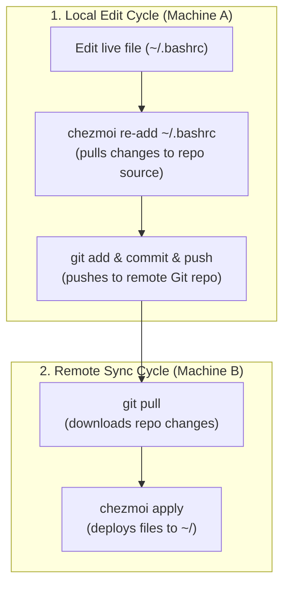

# Dotfiles — single owner

Use this flow when **one person** clones this repo across their own machines.
The `dotfiles/` folder in this repo is the chezmoi source directly — no
external dotfiles repo is needed.

## How it works



Ansible configures chezmoi to use `<repo>/dotfiles/` as its source directory.
`chezmoi apply` copies files from there to `~`.

OS-specific aliases land in `~/.config/shell/os.sh` via an Ansible template.
Shell configs source `~/.config/shell/*.sh` by glob, so chezmoi never needs
to know which OS it's on.

## Edit a dotfile and commit

```bash
# Option A — edit the source directly, then apply
$EDITOR ~/workspace/workstation/dotfiles/dot_bashrc
chezmoi apply

# Option B — edit the live file, then pull it back into the source
$EDITOR ~/.bashrc
chezmoi re-add ~/.bashrc

# Commit to the repo
cd ~/workspace/workstation
git add dotfiles/
git commit -m "chore: update bashrc"
git push
```

## Sync to another machine

```bash
git pull
chezmoi apply
```
