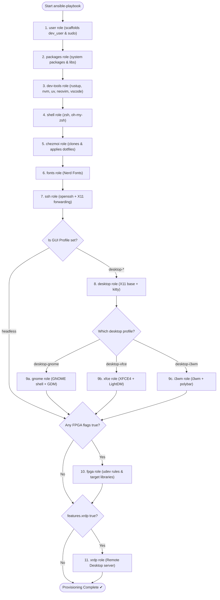

# Host configuration

## Environment profiles

Each host has a `profile` variable that controls which desktop environment (if
any) is installed. Set it in `ansible/inventory/host_vars/<hostname>.yml`:

| Profile | Description |
|---|---|
| `headless` | No GUI — SSH + X11 forwarding only |
| `desktop-gnome` | GNOME Shell + GDM + kitty |
| `desktop-xfce` | XFCE 4 + LightDM + kitty |
| `desktop-i3wm` | i3wm + LightDM + polybar/rofi/dunst/picom + kitty |

SSH and X11 forwarding (`X11Forwarding yes`, `AllowAgentForwarding yes`) are
**always configured** on every host regardless of profile.

## Feature flags

Feature flags are set per host in `ansible/inventory/host_vars/<hostname>.yml`
and organised into three groups. All flags default to the conservative option —
enable only what you need.

### Editor

| Flag | Default | Effect |
|---|---|---|
| `features.editor.neovim` | `true` | Install neovim binary (GitHub release) |
| `features.editor.lazyvim` | `false` | Pre-install LazyVim plugins after dotfiles are applied — first launch is instant rather than downloading on entry (implies neovim) |
| `features.editor.vscode` | `false` | Install VS Code via the Microsoft apt/dnf repository |

`neovim` defaults to `true` because the shell dotfiles set `$EDITOR=nvim`. Set
it `false` only if you will install a different editor by hand.

### FPGA toolchain

Vivado and Quartus are commercial tools that require manual installation after
provisioning. The flags below install the **runtime libraries** those tools need
to run, udev rules for hardware programmers, and (for `oss`) the open-source
alternatives.

| Flag | Default | Effect |
|---|---|---|
| `features.fpga.vivado` | `false` | AMD/Xilinx runtime libs + Xilinx/Digilent udev rules |
| `features.fpga.quartus` | `false` | Intel/Altera runtime libs + USB-Blaster udev rules |
| `features.fpga.oss` | `false` | Open-source EDA: iverilog, gtkwave, verilator, ghdl, nvc |

USB/JTAG libraries (`libusb`, `usbutils`, `fxload`) and hardware-access groups
(`plugdev`, `dialout`, `video`, `tty`) are added whenever **any** FPGA
sub-flag is true — they are shared across all tool vendors.

### Remote access

| Flag | Default | Effect |
|---|---|---|
| `features.xrdp` | `false` | Install xrdp — Windows Remote Desktop access on port 3389 |

## Example host\_vars

```yaml
# ansible/inventory/host_vars/my_laptop.yml
profile: desktop-xfce

features:
  editor:
    neovim: true
    lazyvim: true    # pre-install plugins so first launch is instant
    vscode: false
  fpga:
    vivado: false
    quartus: false
    oss: false
  xrdp: false
```

```yaml
# ansible/inventory/host_vars/fpga_workstation.yml
# Quartus-only FPGA workstation with VS Code and RDP
profile: desktop-xfce

features:
  editor:
    neovim: true
    lazyvim: false
    vscode: true
  fpga:
    vivado: false
    quartus: true
    oss: true      # gtkwave, iverilog etc. useful regardless of tool vendor
  xrdp: true
```

```yaml
# ansible/inventory/host_vars/dev_server.yml
profile: headless

features:
  editor:
    neovim: true
    lazyvim: false
    vscode: false
  fpga:
    vivado: false
    quartus: false
    oss: false
  xrdp: false
```

## Shared tunables

Defaults live in `ansible/inventory/group_vars/all.yml` and can be
overridden per group or host:

| Variable | Description |
|---|---|
| `packages` | System packages per package manager |
| `github_binaries` | Base dev tool versions (eza, fd, rg, bat, fzf, …) |
| `neovim_version` / `neovim_url` | Neovim release to install |
| `nvm_version` / `node_version` | nvm and Node.js versions |
| `profile` | Default environment profile |
| `dev_user` | Developer account to create and provision (default: SSH user) |

See [custom-user.md](custom-user.md) for provisioning a machine for a user
other than the Ansible SSH user.

> **Git identity** (`name`, `email`, `editor`) is a personal dotfile — edit
> `dotfiles/dot_gitconfig` (owner mode) or your own dotfiles repo (shared mode).

## Repository structure

```
bootstrap.sh              # entry point — installs Ansible, runs site.yml
ansible.cfg               # Ansible config (inventory + roles paths)
requirements.yml          # Ansible Galaxy collections

controller/
  Containerfile           # Ansible controller image (Podman/Docker)
  run.sh                  # wrapper: build image + run ansible-playbook remotely

ansible/
  site.yml                # full provisioning playbook (profile-aware)
  inventory/
    hosts.yml             # workstations + servers groups
    group_vars/
      all.yml             # packages, feature flag defaults, dev_user
      workstations.yml    # workstation defaults (profile, features)
    host_vars/
      localhost.yml       # local machine overrides
  roles/
    user/                 # create dev_user account + passwordless sudo
    packages/             # apt / dnf system packages (incl. direnv)
    dev-tools/            # base CLI tools + rustup + nvm + uv + optional editors
    shell/                # oh-my-zsh + OS-specific shell snippet
    chezmoi/              # configure chezmoi source, apply dotfiles
    fonts/                # Nerd Fonts
    ssh/                  # openssh-server + X11 forwarding (always on)
    desktop/              # Xorg base + kitty (when profile contains 'desktop')
    gnome/                # GNOME Shell + GDM (desktop-gnome)
    xfce/                 # XFCE 4 + LightDM (desktop-xfce)
    i3wm/                 # i3wm stack + LightDM (desktop-i3wm)
    fpga/                 # FPGA runtime libs + udev rules (per sub-flag)
    xrdp/                 # xrdp RDP server (features.xrdp)

### Ansible Role Execution Flow



dotfiles/                 # chezmoi source — applied to ~/
  dot_config/
    shell/
      exports.sh          # PATH, EDITOR
      aliases.sh          # eza, git, fzf shortcuts
      functions.sh        # nav, yazi, git helpers
      direnv.sh           # direnv shell hook (bash + zsh)
      uv.sh               # UV_PYTHON default + mkvenv function
    uv/
      requirements.txt    # base packages for every new project venv
    nvim/                 # LazyVim configuration

local-vms/
  vm-fpga-dev-alma-9/     # FPGA dev VM (AlmaLinux 9)
  vm-fpga-dev-alma-10/    # FPGA dev VM (AlmaLinux 10)
  vm-fpga-dev-debian-13/  # FPGA dev VM (Debian 13)
  vm-fpga-dev-ubuntu-2404/ # FPGA dev VM (Ubuntu 24.04)
  vm-fpga-dev-ubuntu-2604/ # FPGA dev VM (Ubuntu 26.04)
  settings.yml            # Local hypervisor storage settings overrides

tests/
  container/
    Dockerfile.{debian,ubuntu,almalinux}
  vm/
    machines.yml          # Declarative test machine definitions
  run_container_tests.sh
  run_vm_tests.sh
  run_vm_tests.ps1

```
