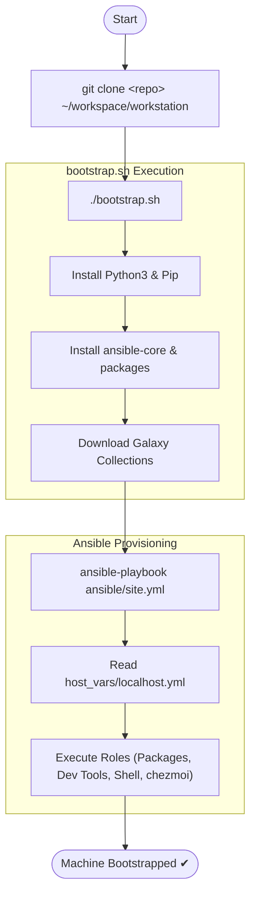

# Quick start — local installation



Bootstrap this machine by cloning the repo locally and running the
provisioning script directly. This is the owner flow: the repo itself is the
dotfiles source.

## Bootstrap a new machine

```bash
git clone <repo> ~/workspace/workstation
cd ~/workspace/workstation
./bootstrap.sh
```

`bootstrap.sh` installs pip3, uses it to install a modern version of `ansible-core` (>=2.17) in user space, pulls the required collections, and runs
`ansible/site.yml`.

The profile that gets installed depends on `ansible/inventory/host_vars/<hostname>.yml`.
For `localhost` the default is **`desktop-xfce`** (XFCE 4 + LightDM). To change
it, edit that file before running `bootstrap.sh` — see
[Host configuration](host-configuration.md) for all available profiles.

## Daily use

```bash
# Re-apply dotfiles after editing dotfiles/
chezmoi apply

# Full re-provision (safe to run again — skips what is already done)
ansible-playbook ansible/site.yml -K
```
