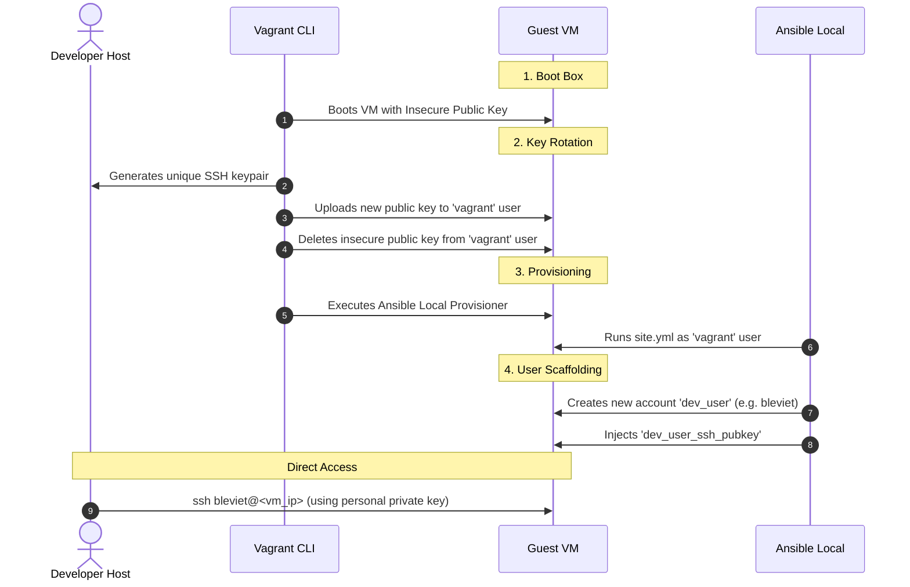

# Vagrant SSH & Provisioning Lifecycle

Modern operating systems (such as Ubuntu 26.04 and AlmaLinux 10) disable password-based SSH authentication by default for security. This article explains how Vagrant and Ansible bypass password requirements during VM initialization, how keys are rotated, and how your personal SSH key is securely injected.

---

## The Authentication Lifecycle

The entire lifecycle consists of four main phases:



---

## Detailed Phases

### Phase 1: The Base Box & The Insecure Key
When you initialize a VM using a public box (like `bento/ubuntu-26.04` or `almalinux/10`), the guest OS starts from a pre-configured image. 
- These images contain a default account named `vagrant`.
- To allow initial automation, the base image contains a well-known, public SSH key called the **Vagrant insecure public key** in `/home/vagrant/.ssh/authorized_keys`.
- Password authentication is **not** used or required for this connection.

### Phase 2: Key Rotation on First Boot
Because anyone can access the insecure private key, Vagrant automatically rotates it immediately after the VM boots for the first time:
1. Vagrant generates a **new, unique SSH keypair** on your host computer (stored in your project's `.vagrant/machines/<machine>/<provider>/private_key`).
2. It connects to the VM using the insecure key.
3. It appends the newly generated public key to `/home/vagrant/.ssh/authorized_keys`.
4. It removes the insecure key from the VM's authorized keys list.
5. All future `vagrant` commands (like `vagrant ssh`, `vagrant provision`, or `vagrant destroy`) will use this unique key.

You can observe this process in your console logs during `vagrant up`:
```text
==> jenkins-param-vm: Waiting for machine to boot. This may take a few minutes...
    jenkins-param-vm: SSH address: 127.0.0.1:2200
    jenkins-param-vm: SSH username: vagrant
    jenkins-param-vm: SSH auth method: private key
    jenkins-param-vm: 
    jenkins-param-vm: Vagrant insecure key detected. Vagrant will automatically replace
    jenkins-param-vm: this with a newly generated keypair for better security.
    jenkins-param-vm: 
    jenkins-param-vm: Inserting generated public key within guest...
    jenkins-param-vm: Removing insecure key from the guest if it's present...
    jenkins-param-vm: Key inserted! Disconnecting and reconnecting using new SSH key...
==> jenkins-param-vm: Machine booted and ready!
```

### Phase 3: Ansible Provisioning
Once the connection is secure:
1. Vagrant triggers the `ansible_local` provisioner.
2. Ansible runs directly inside the guest VM as the `vagrant` user.
3. Since the `vagrant` user has passwordless sudo configured in the base box, Ansible has full root privileges to install packages, services, and create accounts.

### Phase 4: Custom Developer Account & Personal Key Injection
If you specify a custom developer username (using the `dev_user` variable in `host_vars/<hostname>.yml`), the playbook invokes the `user` role:
1. **User Creation**: The playbook creates your account (e.g. `bleviet`), sets the shell (e.g. `/bin/zsh`), and grants passwordless sudo.
2. **Key Injection**: The playbook copies your personal public key from `dev_user_ssh_pubkey` to your new account's authorized keys:
   ```yaml
   # ansible/roles/user/tasks/main.yml
   - name: Add SSH public key for developer user
     become: true
     ansible.posix.authorized_key:
       user: "{{ dev_user }}"
       key: "{{ dev_user_ssh_pubkey }}"
       state: present
     when:
       - dev_user != ansible_facts['user_id']
       - dev_user_ssh_pubkey | length > 0
   ```
3. The password for the new account remains locked (disabled) so that only key-based SSH logins are permitted.

---

## Connecting as Your Custom User

Once provisioning is finished, you can bypass the `vagrant` account entirely. Simply SSH into the VM using your own personal private key:

```bash
ssh -i ~/.ssh/id_ed25519 bleviet@<vm_ip_or_hostname>
```

This ensures complete isolation, compliance with modern SSH security standards, and instant access to your customized environment containing all your configured packages and dotfiles.
